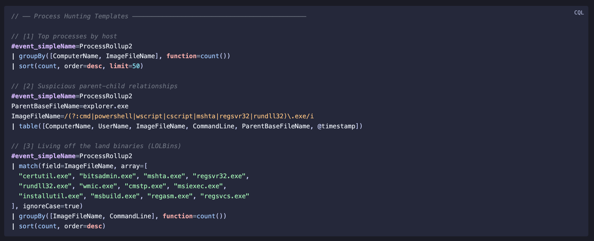

# talon-cql

**Obsidian plugin — syntax highlighting for CrowdStrike CQL (LogScale Query Language)**

Threat hunters who document their work in Obsidian — playbooks, runbooks, DFIR notes — can now get proper syntax highlighting for embedded CQL queries. No equivalent plugin exists in the Obsidian community.



---

## Usage

````markdown
```cql
#event_simpleName=ProcessRollup2
ImageFileName=/powershell\.exe/i
| groupBy([ComputerName, CommandLine], function=count())
| sort(count, order=desc)
```
````

Also accepts ` ```logscale ` as an alias.

Works in both **reading mode** and **editing mode**.

---

## Install

### Community Plugin *(pending approval)*

Search for **Talon CQL** in **Settings → Community Plugins**.

### Manual

1. Download `main.js`, `manifest.json`, `styles.css` from the [latest release](../../releases/latest)
2. Create `.obsidian/plugins/talon-cql/` in your vault
3. Copy the three files there
4. Enable in **Settings → Community Plugins**

---

## What gets highlighted

| Token | Example |
|---|---|
| Event fields | `#event_simpleName`, `#aid`, `#cid` |
| Built-in functions | `groupBy`, `eval`, `timeChart`, `join` |
| Namespaced functions | `array:contains`, `math:abs`, `time:hour` |
| Keywords | `case`, `and`, `or`, `not`, `asc`, `desc` |
| Operators | `\|` `:=` `=~` `!=` `<=` `>=` |
| Strings | `"double"` `'single'` |
| Regex literals | `/pattern/i` |
| Numbers | `42`, `3.14` |
| Comments | `//` and `/* */` |

---

## Query Templates

Ready-to-use hunting queries in [`templates/`](./templates):

| File | Content |
|---|---|
| [`process-hunting.cql`](./templates/process-hunting.cql) | LOLBins, encoded PowerShell, parent-child chains |
| [`network-hunting.cql`](./templates/network-hunting.cql) | Beaconing, suspicious ports, geo anomalies |
| [`identity-hunting.cql`](./templates/identity-hunting.cql) | Brute force, off-hours logons, LSASS access |

---

## Build

```bash
npm install
npm run build   # production → generates main.js
npm run dev     # watch mode for development
```

---

## References

- [CQL Syntax Reference](https://library.humio.com/data-analysis/syntax.html)
- [LogScale Functions](https://library.humio.com/data-analysis/functions.html)
- [CrowdStrike LogScale Community Content](https://github.com/CrowdStrike/logscale-community-content)

---

## License

MIT
